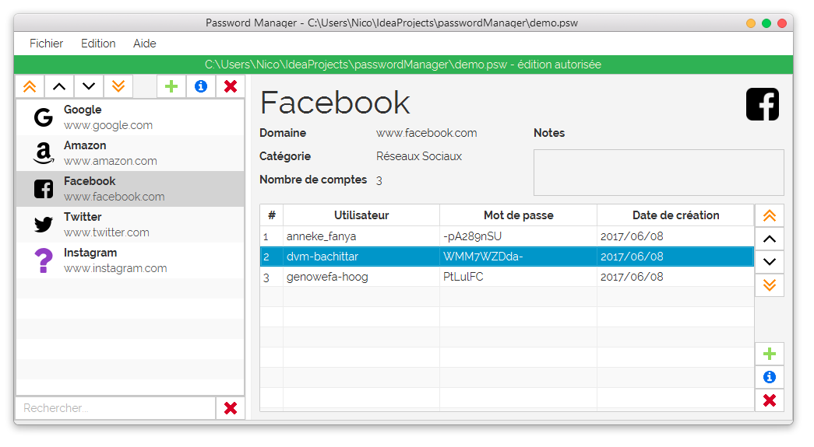
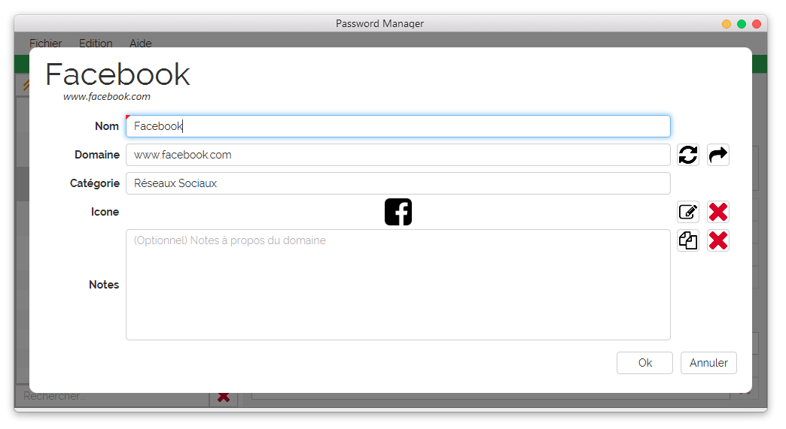
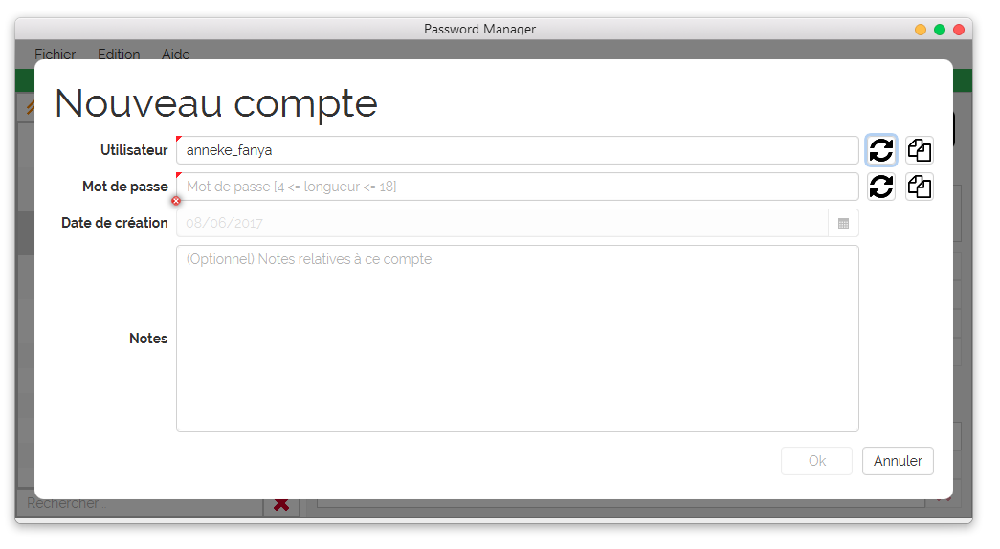
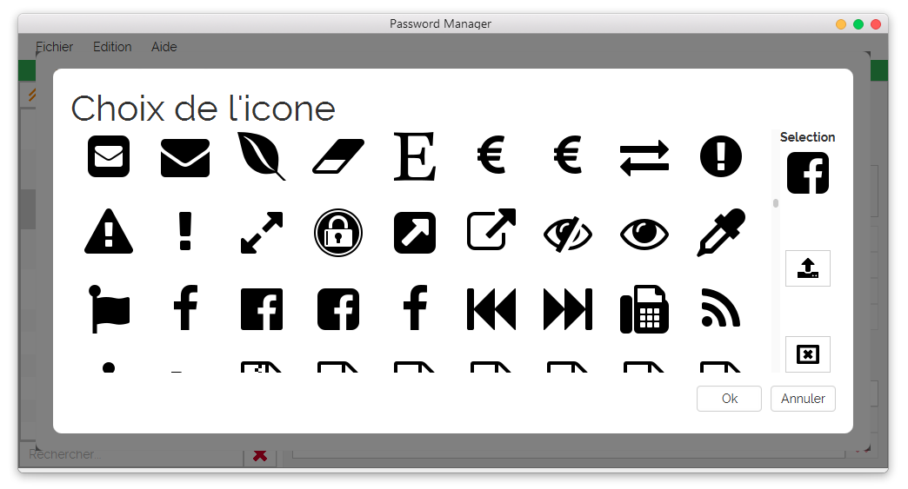
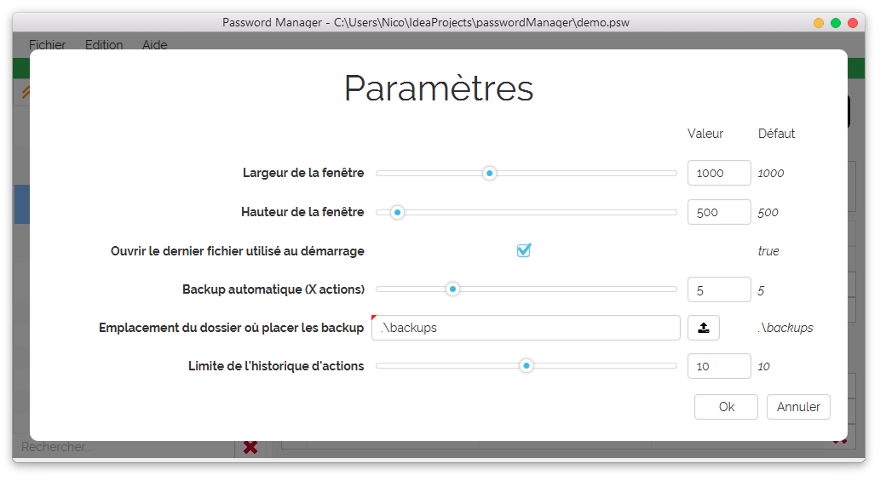

# PasswordManager

[EN]

My personal password manager in Javafx 8

Only in french (for now)

Features:
* Organization of accounts, by domain
* Random generation available for username and passwords
* Choose freely domain icons
* Encryption of save files, with multiple security levels
* Filter domains
* Undo & redo
* Drag and drop, move domains and accounts up and down freely
* Support for adding notes to domains and accounts
* Automatic backup
* Support for Google Drive

[FR]

Mon password manager personnel avec Javafx 8

Uniquement en français (pour l'instant)

Fonctionnalités:
* Organisation des comptes, par domaines
* Génération aléatoire disponible pour les noms d'utilisateurs et les mot de passes
* Choix libre des icones des domaines
* Encryption des fichiers de sauvegarde, avec plusieurs niveaux de sécurité
* Filtrage des domaines
* Defaire & refaire
* Glisser-déposer, déplacement des domaines et des comptes librement
* Support pour l'ajout de notes aux domaines et aux comptes
* Sauvegardes automatiques
* Support pour Google Drive

# Todo
-> TODO.md

# Screenshots
## App

## Domain edition

## Account edition

## Icon selection

## Settings

## Infos save

# Credits
Icons from [FlatIcon](http://www.flaticon.com),
made by [Dave Gandy](http://www.flaticon.com/authors/dave-gandy), from collection [Font Awesome](http://www.flaticon.com/packs/font-awesome)

And [ControlsFX](http://fxexperience.com/controlsfx/), maintained by Jonathan Giles

